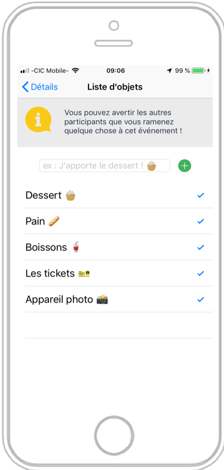
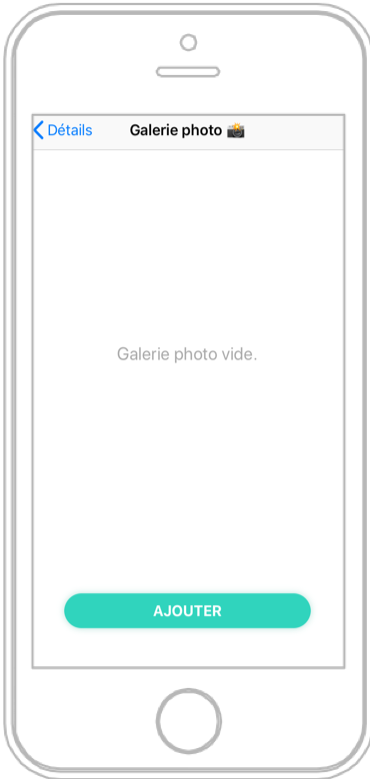
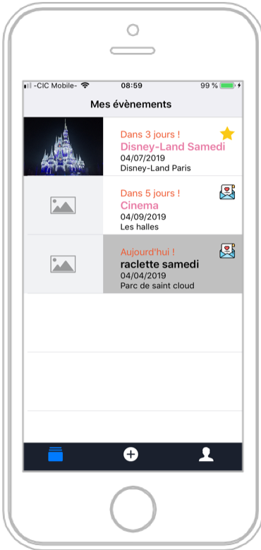
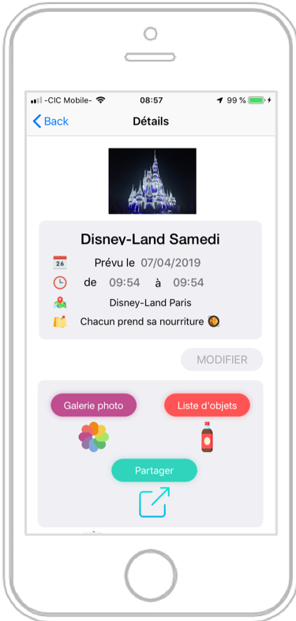
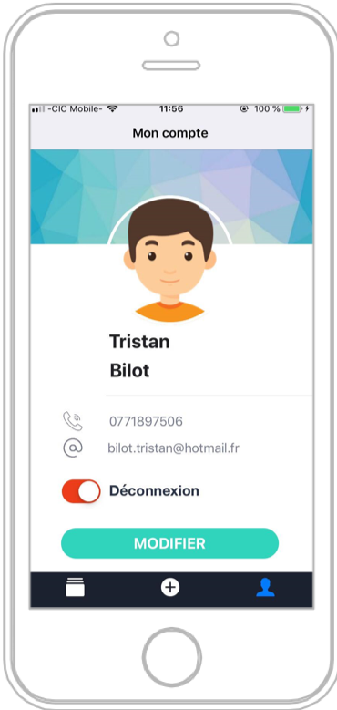
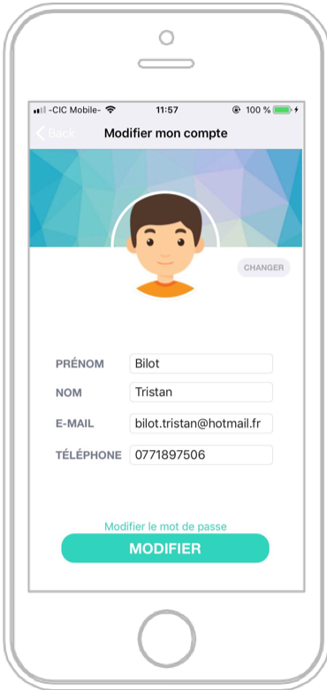

# Cheers
Cheers is an event management iOS app that offer a good way to centralize the different informations of an event and share them with the participants.

  

<h2>List of objects and galery</h2>
Once the user is connected, he can precise that he bring some objects to the event by adding some elements in the list.
All the participants of the event can also share photos and videos from the event to the galery.
This feature is a good way to centralize the memories of the event and then to remember it years after.
  

  
  

<h2>Connection and subscription</h2>
Every user of Cheers must create an account directly on the app or with the Facebook API. The connection and subsription feature use the Firebase authentication system.
  

<h2>List of events and informations</h2>
The creator of the events can see his events (with a star indicator) and the events to which he is invited (with an envelop indicator).
  

<h2>Manage your account</h2>
 

